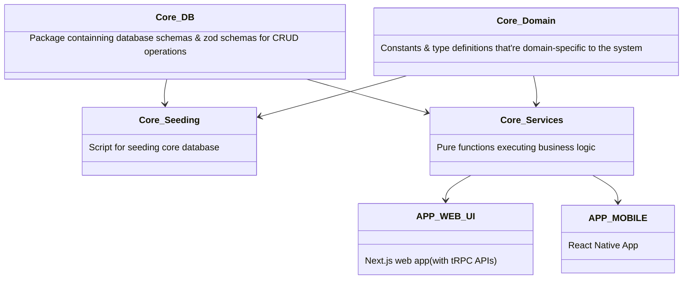

# Architecture

The TMS (training management system) has a few components, some of which are shared. Below is a mermaid diagram illustrating the relationship between the apps & packages within the codebase

